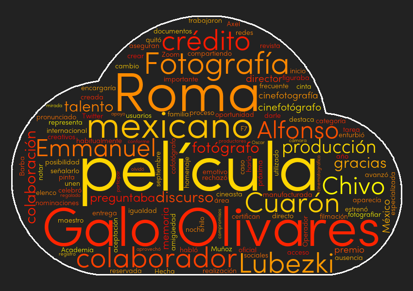

# Article Summarizer

This project implements a custom algorithm to extract the most important sentences and keywords from Spanish news articles.

It was fully developed in `Python` and it is inspired by similar projects seen on `Reddit` news subreddits that use the term frequency–inverse document frequency (`tf–idf`).

The 2 most important files are:

* `summary.py` : A Python script that applies a custom algorithm to a string of text and extracts the top ranked sentences and words.

* `bot.py` : A Reddit bot that connects to a subreddit and gets the latest posts, then it web scrapes them, extracts the text and passes it to the first script.

This project uses the following Python libraries

* `NLTK` : Used to tokenize the article into sentences.
* `PRAW` : Makes the use of the Reddit API very easy.
* `Requests` : To perform HTTP `get` requests to the articles urls.
* `BeautifulSoup` : Used for extracting the article text.
* `html5lib` : This parser got better compatibility when used with `BeautifulSoup`.
* `tldextract` : Used to extract the domain from an url.
* `wordcloud` : Used to create word clouds with the article text.

After installing the `NLTK` library you must run the following command to install the tokenizers.

`python -c "import nltk; nltk.download('punkt')"`

## Reddit Bot

The bot is simple in nature, it uses the `PRAW` library which is very straightforward to use. The bot polls a subreddit every 10 minutes to get its latest posts.

It first detects if the post hasn't already been processed and then checks if the post url is in the whitelist. This whitelist is currently curated by myself.

If the post and its url passes both checks then a process of web scraping is applied to the url, this is where things start getting interesting.

Before replying to the original submission it checks the percentage of the reduction achieved, if it's too low or too high it skips it and moves to the next submission.

## Web Scraper

Currently in the whitelist there are already more than 100 different domains of news websites. Creating specialized web scrapers for each one is simply not feasible.

The second best thing to do is to make the scraper as accurate as possible.

We start the web scraper on the usual way, with the `Requests` and `BeautifulSoup` libraries.

```python
with requests.get(article_url) as response:
    
    if response.encoding == "ISO-8859-1":
        response.encoding = "utf-8"

    html_source = response.text

for item in ["</p>", "</blockquote>", "</div>", "</h2>", "</h3>"]:
    html_source = html_source.replace(item, item+"\n")

soup = BeautifulSoup(html_source, "html5lib")
```

Very few times I got encoding issues caused by an incorrect encoding guess. To avoid this issue I force Requests to decode with `utf-8`.

When grabbing the text from different tags I often got the strings without separation. I implemented a little hack to add new lines to each tag that usually contains text. This improved the overall accuracy significantly.

My original idea was to only accept websites that used the `<article>` tag. It worked ok, but I soon realized that very few websites use it and those who use it don't use it correctly.

```python
article = soup.find("article").text
```

When accessing the `.text` property of the `<article>` tag I noticed I was also getting the JavaScript code. I backtracked a bit and removed all tags which could add *noise* to the article text.

```python
[tag.extract() for tag in soup.find_all(
        ["script", "img", "ul", "time", "h1", "h2", "h3", "iframe", "style", "form", "footer", "figcaption"])]


# These class names/ids are known to add noise or duplicate text to the article.
noisy_names = ["image", "img", "video", "subheadline",
                "hidden", "tract", "caption", "tweet", "expert"]

for tag in soup.find_all("div"):

    tag_id = tag["id"].lower()

    for item in noisy_names:
        if item in tag_id:
            tag.extract()
```

The above code removed most captions, which usually repeat what's inside in the article.

After that I applied a 3 step process to get the article text.

First I checked all `<article>` tags and grabbed the one with the longest text.


```python
article = ""

for article_tag in soup.find_all("article"):

    if len(article_tag.text) >= len(article):
        article = article_tag.text
```

That worked fine for websites that properly used the `<article>` tag. The longest tag almost always contains the main article.

But that didn't quite worked as expected, I noticed poor quality on the results, sometimes I was getting excerpts for other articles.

That's when I decided to add the fallback, lnstead of only looking for the `<article>` tag I will be looking for `<div>` and `<section>` tags with commonly used `id's`.

```python
# These names commonly hold the article text.
common_names = ["artic", "summary", "cont", "note", "cuerpo", "body"]

# If the article is too short we look somewhere else.
if len(article) <= 650:

    for tag in soup.find_all(["div", "section"]):

        tag_id = tag["id"].lower()

        for item in common_names:
            if item in tag_id:
                # We guarantee to get the longest div.
                if len(tag.text) >= len(article):
                    article = tag.text
```

That increased the accuracy quite a bit, I repeated the code but instead of the `id` attribute I was also looking for the `class` attribute.

```python
# The article is still too short, let's try one more time.
if len(article) <= 650:

    for tag in soup.find_all(["div", "section"]):

        tag_class = "".join(tag["class"]).lower()

        for item in common_names:
            if item in tag_class:
                # We guarantee to get the longest div.
                if len(tag.text) >= len(article):
                    article = tag.text
```

Using all the previous methods greatly increased the overall accuracy of the scraper. In some cases I used partial words that share the same letters in English and Spanish (artic -> article/articulo). The scraper was now compatible with all the urls I tested.

We make a final check and if the article is still too short we abort the process and move to the next url, otherwise we move to the summary algorithm.

## Summary Algorithm

This algorithm was designed to work primarily on Spanish written articles. It consists on several steps:

1. Reformat and clean the original article by removing all whitespaces.
2. Make a copy of the original article and remove all common used words from it.
3. Split the copied article into words and score each word.
4. Split the original article into sentences and score each sentence using the scores from the words.
5. Take the top 5 sentences and top 5 words and return them in chronological order.

### Clean the Article

When extracting the text from the article we usually get a lot of whitespaces, mostly from line breaks (`\n`).

We split the text by that character, then strip all whitespaces and join it again. This is not strictly required to do but helps a lot while debugging the whole process.

### Remove Common and Stop Words

At the top of the script we have a list with the most used Spanish words. My personal preference was to hard code them in lowercase form.

I also loaded a list of the most common stop words in Spanish.

Then I added a copy of each word in uppercase and title form. Which means the list will be 3 times the original size.

```python
with open("./assets/stopwords-es.txt", "r", encoding="utf-8") as temp_file:
    for word in temp_file.read().splitlines():
        COMMON_WORDS.append(" {} ".format(word))

extra_words = list()

for word in COMMON_WORDS:
    extra_words.append(word.title())
    extra_words.append(word.upper())

COMMON_WORDS.extend(extra_words)
```

### Scoring Words

At this point I added a personal touch to the algorithm. First I made a copy of the article and then removed all common words from it.

Afterwards I used a `collections.Counter` object to do the initial scoring.

Then I applied a multiplier bonus to words that start in uppercase and are equal or longer than 4 characters. Most of the time those words are names of places, people or organizations.

Finally I set to zero the score for all words that are actually numbers.

```python
for item in COMMON_WORDS:
    prepared_article = prepared_article.replace(item, " ")

scored_words = Counter(prepared_article.split(" "))
del scored_words[""]

for word in scored_words:

    if word[0].isupper() and len(word) >= 4:
        scored_words[word] *= 3

    if word.isdigit():
        scored_words[word] = 0
```

### Scoring Sentences

Now that we have the final scores for each word it is time to score each sentence from the article.

To do this we first need to split the article into sentences. I tried various approaches, including `RegEx` but the one that worked best was the `NLTK` library.

```python
scored_sentences = list()

for index, line in enumerate(tokenize.sent_tokenize(cleaned_article)):
    
    # In some edge cases we have duplicated sentences, we make sure that doesn't happen.
    if line not in [line for score, index, line in scored_sentences]:
        scored_sentences.append([score_line(line, scored_words), index, line])
```

`scored_sentences` is a list of lists. Each inner list contains 3 values. The sentence score, its index and the sentence itself. Those values will be used in the next step.

The code below shows how the lines are scored.

```python
def score_line(line, scored_words):

    temp_line = line[:]

    # We then apply the same clean algorithm. Removing common words.
    for word in COMMON_WORDS:
        temp_line = temp_line.replace(word, " ")

    # We now sum the total number of ocurrences for all words.
    temp_score = 0

    for word in temp_line.split(" "):
        temp_score += scored_words[word]

    # We apply a bonus score to sentences that contain financial information.
    line_lowercase = line.lower()
    is_financial = False

    for word in FINANCIAL_WORDS:
        if word in line_lowercase:
            is_financial = True
            break

    if is_financial:    
        temp_score *= 1.5

    return temp_score  
```

We apply a multiplier to sentences that contain any word that refers to money or finance.

### Chronological Order

This is the final part of the algorithm, we make use of the `sorted()` function to get the top sentences and then reorder them in their original positions.

We sort `scored_sentences` in reverse order, this will give us the top scored sentences first. We start a small counter variable so it breaks the loop once it hits 5. We also discard all sentences that are 3 characters or less (sometimes there are sneaky zero-width characters).

```python
top_sentences = list()
counter = 0

for score, index, sentence in sorted(scored_sentences, reverse=True):

    if counter >= 5:
        break

    # When the article is too small the sentences may come empty.
    if len(sentence) >= 3:

        # We clean the sentence and its index so we can sort in chronological order.
        top_sentences.append([index, sentence])
        counter += 1

return [sentence for index, sentence in sorted(top_sentences)]
```

At the end we use a list comprehension to return only the sentences which are already sorted in chronological order.

### Word Cloud

Just for fun I added a word cloud to each article. To do so I used the `wordcloud` library. This library is very easy to use, you only require to declare a `WordCloud` object and use the `generate` method.

```python
wc = wordcloud.WordCloud() # See cloud.py for full parameters.
wc.generate(prepared_article)
wc.to_file("./temp.png")
```

After generating the image I uploaded it to `Imgur`, got back the url link and added it to the `Markdown` message.



## Conclusion

This was a very fun and interesting project to work on. I may have reinvented the wheel but at least I learned a few cool things.

I'm satisfied with the overall quality of the results and I will keep tweaking the algorithm and applying compatibility enhancements.

As a side note, when testing the script I accidentally requested Tweets, Facebook posts and English written articles. All of them got acceptable outputs, but since those sites are not the target I removed them from the whitelist.